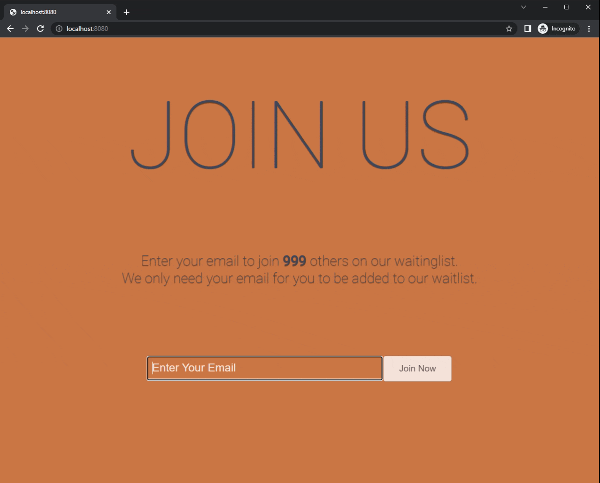

# WaitList

The project is built using [Node.js](https://nodejs.org/en/) and [MySQL](https://www.mysql.com/). <br/>
Data for this project are randomly generated using `faker` package.

## Preview


## Running the app

1. Create the schema for join_us database in MySQL:
```
source schema.sql
```
2. On your terminal, download all the dependencies by typing
   `npm i` or `npm install`
3. Import some preliminary data generated using faker package by running:
```
node data-generator.js
```
4. Run the app:
```
node app.js
```
5. Go to your preferred browser, then go to `localhost:8080`
